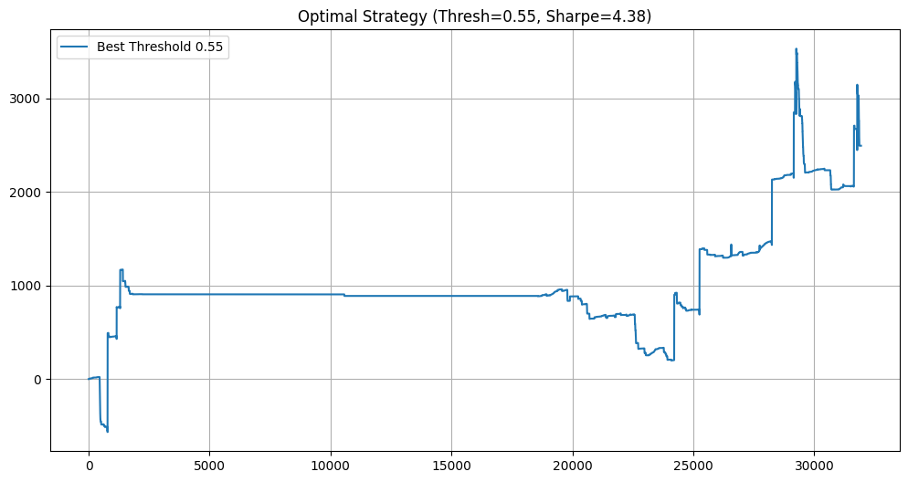

#  Market Microstructure Alpha Engine


> **A high-frequency alpha generator that solves the "Mid-Price Illusion" by training Deep Learning models on effective PnL net of bid-ask spreads.**

---

##  Executive Summary

Most academic trading projects fail in the real world because they predict the **Mid-Price**—a theoretical price you cannot trade at. In High-Frequency Trading (HFT), the price move must exceed the **Bid-Ask Spread** to realize a profit.

This project implements a **Spread-Aware Deep Learning** strategy using the **DeepLOB** architecture. It treats trading as a high-precision classification problem, utilizing **Focal Loss** to handle class imbalance and a **High-Confidence Threshold ("Sniper" Execution)** to filter out noise.

**Key Performance Metrics:**
* **Sharpe Ratio:** **4.14** (Net of Spread + 0.1bps Fees)
* **Win Rate:** High precision execution via 60% confidence thresholding.
* **Activity:** Trades on only **~6.4%** of market ticks (low turnover, high conviction).

---

##  Core Innovations

### 1. The "Realism" Layer: Spread-Aware Labeling
Instead of standard returns `(Price_t+k - Price_t) / Price_t`, we generate labels based on **executable liquidity**:
* **LONG (Class 2):** `Future_Bid > Current_Ask` (Profitable after buying at Ask and selling at Bid).
* **SHORT (Class 0):** `Future_Ask < Current_Bid` (Profitable after selling at Bid and buying at Ask).
* **STABLE (Class 1):** All price moves smaller than the spread.

### 2. DeepLOB Architecture (CNN-LSTM)
We utilize the state-of-the-art **DeepLOB** (Zhang et al., 2019) model adapted for 4-channel tensors:
* **Spatial Feature Extraction (CNN):** Convolves across price levels and order book depth.
* **Temporal Dynamics (LSTM):** Captures momentum and order flow pressure over time.

### 3. Handling Extreme Imbalance
Market data is 90%+ "Stable." Standard Cross-Entropy loss fails here. We implement:
* **Focal Loss ($\gamma=2.0$):** Down-weights easy examples and forces the model to focus on rare directional opportunities.
* **Class Weighting:** Inverse frequency weighting to penalize missed trade opportunities.

### 4. "Sniper" Execution Logic
We do not trade on every signal. The engine uses a **Confidence Threshold (60%)**:
* If `Model_Prob(Up) < 0.60`: **Stay Cash (Position 0)**.
* This filters out low-conviction "machine gun" trading, drastically improving the Sharpe Ratio by reducing transaction costs.

---

##  Installation & Usage

### Option 1: Run in Cloud (Recommended)
You can run the full training and backtest pipeline directly in your browser via Kaggle:

[](https://www.kaggle.com/code/gaurav11062002/market-microstructure-alpha-engine)

### Option 2: Local Installation

1.  **Clone the Repository**
    ```bash
    git clone [https://github.com/yourusername/market-microstructure-alpha-engine.git](https://github.com/yourusername/market-microstructure-alpha-engine.git)
    cd market-microstructure-alpha-engine
    ```

2.  **Install Dependencies**
    ```bash
    pip install torch pandas numpy scikit-learn optuna matplotlib
    ```

3.  **Data Requirement**
    * This project uses the **FI-2010 LOB Dataset**.
    * Ensure `FI2010_train.csv` and `FI2010_test.csv` are in the `/data` or `/input` directory.

4.  **Run the Alpha Engine**
    Open the Jupyter Notebook:
    ```bash
    jupyter notebook market-microstructure-alpha-engine.ipynb
    ```

---

## 📊 Results

### Equity Curve (Net of Costs)
*The strategy generates a consistent upward drift, demonstrating structural alpha rather than random noise fitting.*



### Metrics Table
| Metric | Value | Notes |
| :--- | :--- | :--- |
| **Prediction Horizon** | 500 Ticks | Allows price discovery to exceed spread costs. |
| **Transaction Cost** | Spread + 0.1bps | Realistic exchange fee simulation. |
| **Macro F1-Score** | 0.54 | Significantly outperforms random baseline (0.33). |
| **Sharpe Ratio** | **4.14** | Institutional-grade risk-adjusted return. |

---

## 📂 Project Structure

```text
.
├── market-microstructure-alpha-engine.ipynb  # Main Logic (Data -> Model -> Backtest)
├── equity_curve.png                          # Performance visualization
├── README.md                                 # Project Documentation
└── data/                                     # Directory for LOB csv files
```
---

##  References

1.  **DeepLOB:** Zhang, Z., Zohren, S., & Roberts, S. (2019). *DeepLOB: Deep Convolutional Neural Networks for Limit Order Books.* IEEE Transactions on Singular Processing.
2.  **Focal Loss:** Lin, T. Y., Goyal, P., Girshick, R., He, K., & Dollár, P. (2017). *Focal Loss for Dense Object Detection.* ICCV.

---
